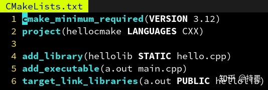

# 高性能并行编程与优化（一）：学C++从CMake学起

GitHub: https://github.com/parallel101<br>
bilibili：https://space.bilibili.com/263032155/channel/collectiondetail?sid=53025

## 什么时编译器
- 是一个根据源代码生成机器码的程序
- g++ main.cpp -o a.out
- 该命令会调用编译器程序g++，让他读取main.cpp中的字符串（称为源码），并根据C++标准生成相应的机器指令码，输出到a.out这个文件中，（称为可执行文件）。
- ./a.out
- 之后执行该命令，操作系统会读取刚刚生成的可执行文件，从而执行其中编译成机器码，调用系统提供的printf函数，并在终端显示出Hello, world。
- 主流：Linux上的GNU系列，llvm生产的c类系列，微软的msvc系列。

## 多文件编译与链接
- 单文件如下缺点： <br>
    1. 所有代码都堆在一起，不利于模块化的理解
    2. 工程变大时，编译时间变得很长，改动一个地方要重新编译。
- 因此，我们需要多文件编译的概念，文件之间通过符号声明相互作用
- g++ -c hello.cpp -o hello.o
- g++ -c main.cpp -o main.o
- 其中使用-c选项指定生成临时的对象文件main.o，之后再根据一系列对象文件进行链接，得到最终的a.out
- g++ hello.o main.o -o a.out

## 为什么需要构建系统(Makefile)
- 文件系统越来越多时，一个个调用g++编译链接很麻烦
- 于是，发明了make这个程序，你只需要写出不同文件之间的依赖关系，和生成各文件的规则。
    ```makefile
    a.out: hello.o main.o
	    g++ hello.o main.o -o a.out

    hello.o: hello.cpp
	    g++ -c hello.cpp -o hello.o

    main.o: main.cpp
	    g++ -c main.cpp -o main.o

    ```
- make a.out
- 敲下这个命令即可构建a.out可执行文件了
- 和直接一个脚本写出完整构建过程相比，make指明依赖关系的好处：
    1. 当更新了hello.cpp文件时只会重新编译hello.o，而不用把main.o重新编译一遍
    2. 能够自动并行地发起对hello.cpp和main.cpp的编译，加快编译速度（make -j）
    3. 用通配符批量生成构建规则，避免对每个.cpp和.o重写g++命令（%.o %.cpp）
- 坏处也十分明显：
    1. make在Unix类系统上时通用的，但在Windows上则不然（想用需要下载模拟环境）
    2. 需要准确地指明每个项目间地依赖关系，有头文件时特别头疼
    3. make的语法十分简单，不像shell或python可以做很多判断等
    4. 不同的编译器有不同的flag规则，为g++准备的参数可能对MSVC不适用

## 构建系统的构建系统（CMake）
- 为了解决make以上的问题，跨平台的CMake应运而生!
- 只需要写一份CMakeList.txt，他就能够在调用时生成当前系统所支持的构建系统
- CMake可以自动检测源文件和头文件的依赖关系，导出到Makefile里。
- CMake具有相对高级的语法，内置的函数能够处理configure，install等常见需求
- CMake可以自动检测当前的编译器，需要添加哪些flag。比如OpenMP，只需要在CMakeLists.txt中指明target_link_libraries(a.out OpenMP::OpenMP_CXX)

## 为什么需要库（library）
- 有时候我们会有多个可执行文件，他们之间用到的某些功能是相同的，我们想把这些共用的功能做成一个库，方便大家一起共享。
- 库中的函数可以被可执行文件调用，也可以被其他库文件调用
- 库文件分为***静态库文件***和***动态库文件***
- 其中静态库相当于直接把代码插入到生成的可执行文件中，会导致体积变大，但是只需要一个文件即可运行。
- 而动态库则是只在生成的可执行文件中生成“插桩”函数，当可执行文件被加载时会读取指定目录中的.dll文件，加载到内存中的空闲位置，并替换相应的“插桩”指向的地址为加载后的地址，这个过程成为重定向，这样以后函数被调用就会跳转到动态加载的地址去。
- Windows：可执行文件的同目录，其次是环境变量%PATH%
- Linux：ELF格式可执行文件的RPATH，其次是/usr/lib等<br>


## CMake中的静态库与动态库
- CMake 除了 add_executable 可以生成可执行文件外，还可以通过 add_library 生成库文件。
- add_library 的语法与 add_executable 大致相同，除了他需要指定是动态库还是静态库：
- add_library(test STATIC source1.cpp source2.cpp) # 生成静态库 libtest.a
- add_library(test SHARED source1.cpp source2.cpp) # 生成动态库 libtest.so
- 动态库有很多坑，特别是 Windows 环境下，初学者自己创建库时，建议使用静态库。
- 但是他人提供的库，大多是作为动态库的，我们之后会讨论如何使用他人的库。
- 创建库以后，要在某个可执行文件中使用该库，只需要：
- target_link_libraries(myexec PUBLIC test) # 为 myexec 链接刚刚制作的库 libtest.a
- 其中 PUBLIC 的含义稍后会说明（CMake 中有很多这样的大写修饰符）<br>


## 为什么 C++ 需要声明
- 在多文件编译章中，说到了需要在 main.cpp 声明 hello() 才能引用。为什么？
- 因为需要知道函数的参数和返回值类型：这样才能支持重载，隐式类型转换等特性。例如 show(3)，如果声明了 void show(float x)，那么编译器知道把 3 转换成 3.0f 才能调用。
- 让编译器知道 hello 这个名字是一个函数，不是一个变量或者类的名字：这样当我写下 hello() 的时候，他知道我是想调用 hello 这个函数，而不是创建一个叫 hello 的类的对象。
- 其实，C++ 是一种强烈依赖上下文信息的编程语言，举个例子：
- vector < MyClass > a; // 声明一个由 MyClass 组成的数组
- 如果编译器不知道 vector 是个模板类，那他完全可以把 vector 看做一个变量名，把 < 解释为小于号，从而理解成判断‘vector’这个变量的值是否小于‘MyClass’这个变量的值。
- 正因如此，我们常常可以在 C++ 代码中看见这样的写法：typename decay::type
- 因为 T 是不确定的，导致编译器无法确定 decay 的 type 是一个类型，还是一个值。因此用 typename 修饰来让编译器确信这是一个类型名……

## 为什么需要头文件
- 为了使用 hello 这个函数，我们刚才在 main.cpp 里声明了 void hello() 。
- 但是如果另一个文件 other.cpp 也需要用 hello 这个函数呢？也在里面声明一遍？
- 如果能够只写一遍，然后自动插入到需要用 hello 的那些 .cpp 里就好了……<br>


## 头文件 - 批量插入几行代码的硬核方式

- 没错，C 语言的前辈们也想到了，他们说，既然每个 .cpp 文件的这个部分是一模一样的，不如我把 hello() 的声明放到单独一个文件 hello.h 里，然后在需要用到 hello() 这个声明的地方，打上一个记号，#include “hello.h” 。然后用一个小程序，自动在编译前把引号内的文件名 hello.h 的内容插入到记号所在的位置，这样不就只用编辑 hello.h 一次了嘛~
- 后来，这个编译前替换的步骤逐渐变成编译器的了一部分，称为预处理阶段，#define 定义的宏也是这个阶段处理的。
- 此外，在实现的文件 hello.cpp 中导入声明的文件 hello.h 是个好习惯，可以保证当 hello.cpp 被修改时，比如改成 hello(int)，编译器能够发现 hello.h 声明的 hello() 和定义的 hello(int) 不一样，避免“沉默的错误”。<br>
<br>
- 实际上 cstdio 也无非是提供了 printf 等一系列函数声明的头文件而已，实际的实现是在 libc.so 这个动态库里。其中 这种形式表示不要在当前目录下搜索，只在系统目录里搜索，”hello.h” 这种形式则优先搜索当前目录下有没有这个文件，找不到再搜索系统目录。
- 此外，在实现的文件 hello.cpp 中也导入声明的文件 hello.h 是个好习惯：
- 可以保证当 hello.cpp 被修改时，比如改成 hello(int)，编译器能够发现 hello.h 声明的 hello() 和定义的 hello(int) 不一样，避免“沉默的错误”（虽然对支持重载的 C++ 不奏效）
- 可以让 hello.cpp 中的函数需要相互引用时，不需要关心定义的顺序。

## 头文件进阶 - 递归地使用头文件
- 在 C++ 中常常用到很多的类，和函数一样，类的声明也会被放到头文件中。
- 有时候我们的函数声明需要使用到某些类，就需要用到声明了该类的头文件，像这样递归地 #include 即可：<br>

- 但是这样造成一个问题，就是如果多个头文件都引用了 MyClass.h，那么 MyClass 会被重复定义两遍：
- 解决方案：在头文件前面加上一行：#pragma once
- 这样当预处理器第二次读到同一个文件时，就会自动跳过
- 通常头文件都不想被重复导入，因此建议在每个头文件前加上这句话<br>


## CMake 中的子模块
- 复杂的工程中，我们需要划分子模块，通常一个库一个目录，比如：
- 这里我们把 hellolib 库的东西移到 hellolib 文件夹下了，里面的 CMakeLists.txt 定义了 hellolib 的生成规则。
- 要在根目录使用他，可以用 CMake 的 add_subdirectory 添加子目录，子目录也包含一个 CMakeLists.txt，其中定义的库在 add_subdirectory 之后就可以在外面使用。
- 子目录的 CMakeLists.txt 里路径名（比如 hello.cpp）都是相对路径，这也是很方便的一点。<br>
<br>
<br>
<br>

## 子模块的头文件如何处理
- 因为 hello.h 被移到了 hellolib 子文件夹里，因此 main.cpp 里也要改成：
    ```cpp
    #include "../hellolib/hello.h"
    ```
- 如果要避免修改代码，我们可以通过 target_include_directories 指定
- a.out 的头文件搜索目录：(其中第一个 hellolib 是库名，第二个是目录)<br>


- 这样甚至可以用 来引用这个头文件了，因为通过 target_include_directories 指定的路径会被视为与系统路径等价：<br>
    <br>

    

- 但是这样如果另一个 b.out 也需要用 hellolib 这个库，难道也得再指定一遍搜索路径吗？
- 不需要，其实我们只需要定义 hellolib 的头文件搜索路径，引用他的可执行文件 CMake 会自动添加这个路径：<br>
    

- 这里用了 . 表示当前路径，因为子目录里的路径是相对路径，类似还有 .. 表示上一层目录。
- 此外，如果不希望让引用 hellolib 的可执行文件自动添加这个路径，把 PUBLIC 改成 PRIVATE 即可。这就是他们的用途：决定一个属性要不要在被 link 的时候传播。

## 目标的一些其他选项
- 除了头文件搜索目录以外，还有这些选项，PUBLIC 和 PRIVATE 对他们同理：
- target_include_directories(myapp PUBLIC /usr/include/eigen3) # 添加头文件搜索目录
- target_link_libraries(myapp PUBLIC hellolib) # 添加要链接的库
- target_add_definitions(myapp PUBLIC MY_MACRO=1) # 添加一个宏定义
- target_add_definitions(myapp PUBLIC -DMY_MACRO=1) # 与 MY_MACRO=1 等价
- target_compile_options(myapp PUBLIC -fopenmp) # 添加编译器命令行选项
- target_sources(myapp PUBLIC hello.cpp other.cpp) # 添加要编译的源文件
- 以及可以通过下列指令（不推荐使用），把选项加到所有接下来的目标去：
- include_directories(/opt/cuda/include) # 添加头文件搜索目录
- link_directories(/opt/cuda) # 添加库文件的搜索路径
- add_definitions(MY_MACRO=1) # 添加一个宏定义
- add_compile_options(-fopenmp) # 添加编译器命令行选项

## 第三方库 - 作为纯头文件引入
- 有时候我们不满足于 C++ 标准库的功能，难免会用到一些第三方库。
- 最友好的一类库莫过于纯头文件库了
- 只需要把他们的 include 目录或头文件下载下来，然后 include_directories(spdlog/include) 即可。
- 缺点：函数直接实现在头文件里，没有提前编译，从而需要重复编译同样内容，编译时间长。<br>
    

## 第三方库 - 作为子模块引入
- 第二友好的方式则是作为 CMake 子模块引入，也就是通过 add_subdirectory。
- 方法就是把那个项目（以fmt为例）的源码放到你工程的根目录(自带CMakeLists.txt)<br>
    
- 子模块的问题有：如果a模块引入b，c模块也引入b，那么就会产生菱形依赖的问题而出错。因此可以采用系统预安装的第三方库。

## CMake - 引用系统中预安装的第三方库
- 可以通过 find_package 命令寻找系统中的包/库：
- find_package(fmt REQUIRED)
- target_link_libraries(myexec PUBLIC fmt::fmt)
- 为什么是 fmt::fmt 而不是简单的 fmt？
- 现代 CMake 认为一个包 (package) 可以提供多个库，又称组件 - - - - (components)，比如 TBB 这个包，就包含了 tbb, tbbmalloc, tbbmalloc_proxy 这三个组件。
- 因此为避免冲突，每个包都享有一个独立的名字空间，以 :: 的分割（和 C++ 还挺像的）。
- 你可以指定要用哪几个组件：
- find_package(TBB REQUIRED COMPONENTS tbb tbbmalloc REQUIRED)
- target_link_libraries(myexec PUBLIC TBB::tbb TBB::tbbmalloc)<br>
    

不同的包之间常常有着依赖关系，而包管理器的作者为 find_package 编写的脚本（例如/usr/lib/cmake/TBB/TBBConfig.cmake）能够自动查找所有依赖，并利用刚刚提到的 PUBLIC PRIVATE 正确处理依赖项，比如如果你引用了 OpenVDB::openvdb 那么 TBB::tbb 也会被自动引用。

## 安装第三方库 - 包管理器
- Linux 可以用系统自带的包管理器（如 apt）安装 C++ 包。

## 总结
- 编译器是什么: 是一个根据源代码生成机器码的程序，例如，g++编译器的输入是保存字符串源码的文件，输出是保存机器指令码的文件（也叫可执行文件）。
- 多文件编译与链接: 可以通过g++ -c 生成临时对象文件，之后根据一系列对象文件进行链接得到可执行文件，这样当某个文件的源码变更时，只需要编译这个改动的源文件即可。
- 构建系统(makefile): make是一个构建系统程序，只需要写出不同文件之间的依赖关系和生成各个文件的规则，就能自动构建可执行文件。其相对与通过脚本写出完整的构建过程，优点在于，首先是当编译进行过一次，改动后，只会自动编译改动的文件，二是可以并行编译，三是可以通过通配符避免重复的写g++命令。
- 构建系统的构建系统(cmake): 写一份 CMakeLists.txt，就能够在调用时生成当前系统所支持的构建系统。CMake 可以自动检测源文件和头文件之间的依赖关系，导出到 Makefile 里。CMake 具有相对高级的语法，内置的函数能够处理 configure，install 等常见需求。CMake 可以自动检测当前的编译器，需要添加哪些 flag。比如 OpenMP，只需要在 CMakeLists.txt 中指明 target_link_libraries(a.out OpenMP::OpenMP_CXX) 即可。
- 为什么需要库(library): 有多个可执行文件，他们之间用到的某些功能是相同的，那么把这些共用的功能做成一个库，方便大家一起共享。库中的函数可以被可执行文件调用，也可以被其他库文件调用。库文件又分为静态库文件和动态库文件。其中静态库相当于直接把代码插入到生成的可执行文件中，会导致体积变大，但是只需要一个文件即可运行。而动态库则只在生成的可执行文件中生成“插桩”函数，当可执行文件被加载时会读取指定目录中的.dll文件，加载到内存中空闲的位置，并且替换相应的“插桩”指向的地址为加载后的地址，这个过程称为重定向。这样以后函数被调用就会跳转到动态加载的地址去。
- 为什么 C++ 需要声明: 因为需要知道函数的参数和返回值类型：这样才能支持重载，隐式类型转换等特性。让编译器知道 hello 这个名字是一个函数，不是一个变量或者类的名字。
- 为什么需要头文件: 引用头文件本质上是将头文件中的源码插入到正在引用的文件中，这样可以减少一个函数在各种地方不断的声明，而将声明和实现分开是方便程序员查看。