# 高性能并行编程与优化（二）：RAll与智能指针

GitHub: https://github.com/parallel101<br>
bilibili：https://space.bilibili.com/263032155/channel/collectiondetail?sid=53025

## C++的历史速现

### C语言时期
- 古代的C语言：
    ```cpp
    #include <stdlib.h>
    #include <stdio.h>

    int main()
    {
        size_t nv = 4;
        int *v = (int *)malloc(nv * sizeof(int));
        v[0] = 4;
        v[1] = 3;
        v[2] = 2;
        v[3] = 1;

        int sum = 0;
        for(size_t i = 0; i < nv; i++)
        {
            sum += v[i];
        }

        printf("%d\n",sum);

        free(v);
        return 0;
    }
    ```
    可以看到，我们首先需要给指针分配4个int的空间，然后逐一赋值，相加求和，最后释放生成的空间，避免内存泄漏。每分配一次空间都需要释放一次，十分麻烦。

### C++98时期
- 近代：C++98引入 **STL** 容器库
    ```cpp
    #include <vector>
    #include <iostream>

    int main()
    {
        std::vector<int> v(4);
        v[0] = 4;
        v[1] = 3;
        v[2] = 2;
        v[3] = 1;

        int sum = 0;
        for(size_t i = 0; i < v.size(); i++)
        {
            sum += v[i];
        }

        std::cout << sum << std::endl;
        return 0;
    }
    ```
    现在把这些定义长度、空间分配等操作封装在一个类里面，这个类基于模板的，<>里面可以是int，也可以是float等等。传入数据和原来一样，长度用v.size()，<<：C++运算符重载，实现一种多态的效果。C++98是第一个标准化的C++。

### C++11时期
- 近现代：C++11 引入了{}初始化表达式
    ```cpp
    #include <vector>
    #include <iostream>

    int main()
    {
        std::vector<int> v = {4,3,2,1};
        
        int sum = 0;
        for(size_t i = 0; i < v.size(); i++)
        {
            sum += v[i];
        }

        std::cout << sum << std::endl;
        return 0;
    }
    ```
    可以看到，main函数第一句就用{}把定义长度，分配空间，赋值(初始化)完成，最后也不用写free()，因为在类内部的析构函数自动实现了。

- 近现代：C++11 引入了 range-based for-loop
    ```cpp
    #include <vector>
    #include <iostream>

    int main()
    {
        std::vector<int> v = {4,3,2,1};
        
        int sum = 0;
        for(int vi: v)
        {
            sum += vi;
        }

        std::cout << sum << std::endl;
        return 0;
    }
    ```
    使用基于范围的for循环，代替迭代器，对于list没有下标的，也可以正常使用。

- 近现代：for_each()算法模板
    ```cpp
    #include <vector>
    #include <iostream>
    #include <algorithm>

    int sum = 0;

    void func(int vi)
    {
        sum += vi;
    }

    int main()
    {
        std::vector<int> v = {4,3,2,1};

        std::for_each(v.begin(),v.end(),func);

        std::cout << sum << std::endl;
        return 0;
    }
    ```
    利用for_each模板，可以自己定义函数累加，只要支持迭代器的容器均可使用，包括list和map。<br>
    但是这样的操作需要引用外部变量，也需要独立的外部函数，不太方便。

- 近现代：C++11引入了lambda表达式
    ```cpp
    #include <vector>
    #include <iostream>
    #include <algorithm>

    int main()
    {
        std::vector<int> v = {4,3,2,1};

        int sum = 0;
        std::for_each(v.begin(),v.end(),[&] (int vi){
            sum += vi;
        });

        std::cout << sum << std::endl;
        return 0;
    }
    ```
    引入了lambda表达式，可以避免外部定义一个函数，也避免了全局变量的定义，更有利于程序设计。

### C++14时期
- 现代：C++14的 lambda 允许用 auto 自动推断类型
    ```cpp
    #include <vector>
    #include <iostream>
    #include <algorithm>

    int main()
    {
        std::vector<int> v = {4,3,2,1};

        int sum = 0;
        std::for_each(v.begin(),v.end(),[&] (auto vi){
            sum += vi;
        });

        std::cout << sum << std::endl;
        return 0;
    }
    ```
    利用auto自动推断，参数类型，增加通用性

### C++17时期
- 当代：C++17 CTAD / compile-time argument deduction /编译期参数推断
    ```cpp
    #include <vector>
    #include <iostream>
    #include <algorithm>

    int main()
    {
        std::vector v = {4,3,2,1};

        int sum = 0;
        std::for_each(v.begin(),v.end(),[&] (auto vi){
            sum += vi;
        });

        std::cout << sum << std::endl;
        return 0;
    }
    ```
    利用C++17的 CTAD ，甚至都可以不用告诉vector类型，让编译器自动推断。包括tuple和pair等等也做了CTAD

    注：想用C++17，需要在CMakeLists.txt加一行，才能用
    ```CMakeLists
    set(CMAKE_CXX_STANDARD 17)
    ```

- 当代：C++17引入常用数值算法
    ```cpp
    #include <vector>
    #include <iostream>
    #include <numeric> // 利用了这个头文件

    int main()
    {
        std::vector v = {4,3,2,1};

        int sum = std::reduce(v.begin(),v.end());
        int sum = std::reduce(v.begin(),v.end(),0,std::plus{}); // plus可换成multipiles，用做累乘

        int sum = std::reduce(v.begin(),v.end(),0,[&](int x,int y){return x+y;}); // 可自己定义一个，利用lambda表达式
        int sum = std::reduce(v.begin(),v.end(),1,[&](int x,int y){return x*y;});

        std::cout << sum << std::endl;
        return 0;
    }
    ```

### C++20时期
- 未来：C++20引入区间 (ranges)
    ```cpp
    #include <vector>
    #include <iostream>
    #include <numeric>
    #include <ranges>
    #include <cmath>

    int main()
    {
        std::vector v = {4,3,2,1,0,-1,-2};

        for(auto &&vi : v 
            | std::views::filter([](auto &&x) {return x >= 0;})
            | std::views::transform([](auto &&x) {return sqrtf(x);})
            ){
            std::cout << vi << std::endl;
        }

        return 0;
    }
    ```
    可以理解为提供了一个比较方便易用的库

- 未来：C++20引入模块 (module)
    ```cpp
    import <vector>;
    import <iostream>;
    import <numeric>;
    import <ranges>;
    import <cmath>;

    int main()
    {
        std::vector v = {4,3,2,1,0,-1,-2};

        for(auto &&vi : v 
            | std::views::filter([](auto &&x) {return x >= 0;})
            | std::views::transform([](auto &&x) {return sqrtf(x);})
            ){
            std::cout << vi << std::endl;
        }

        return 0;
    }
    ```
    C++20真正把模块作为语言的一部分

- 未来：C++20 允许函数参数为自动推断 (auto)
    ```cpp
    import <vector>;
    import <iostream>;
    import <numeric>;
    import <ranges>;
    import <cmath>;

    void myfunc(auto &&v)
    {
        for(auto &&vi : v 
            | std::views::filter([](auto &&x) {return x >= 0;})
            | std::views::transform([](auto &&x) {return sqrtf(x);})
            ){
            std::cout << vi << std::endl;
        }
    } 
    
    int main()
    {
        std::vector v = {4,3,2,1,0,-1,-2};
        myfunc(v);
        return 0;
    }
    ```

- 未来：C++20 引入协程 (coroutine) 和生成器 (generator)
    ```cpp
    import <vector>;
    import <iostream>;
    import <numeric>;
    import <ranges>;
    import <cmath>;
    import <generator>;

    std::generator<int> myfunc(auto &&v){
        for(auto &&vi: v
            |std::views::filter([](auto &&x) {return x >= 0;})
            | std::views::transform([](auto &&x) {return sqrtf(x);})
            ){
            co_yield vi;
        }
    }

    int main()
    {
        std::vector v = {4,3,2,1,0,-1,-2};
        for (auto &&vi: myfunc(v))
        {
            std::cout << vi << std::endl;
        }
    }
    ```
    协程在百度Apollo中用的很多，底层开发喜欢用协程<br>
    注：百度Apollo是和ROS对标的框架，性能要强于ROS。类似的还有autoware<br>
    虽然C++20 部分功能很好用，但是很多功能CMake都不支持(据说XMake支持)，很不方便

## C++有哪些面向对象的思想

### 封装
- 将多个逻辑上相关的变量包装成一个类
- 比如表达一个数组，需要：起始地址指针v，数组大小nv，最后还要释放，因此C++的vector将他们打包起来，避免漏写或犯错
- 注：不是所有时候都需要使用获取器和设置器，如果你的变量是单独行动的，改变他不影响其他地方，则不需封装，需要封装的是变量去其他地方相关，动一个全都要动。 

### RAll (Resource Acquistion Is Initialization)
资源获取即初始化，反之，资源释放视为销毁<br>
- 应用一：构造函数和析构函数，避免犯错，与Java和Python等垃圾回收语言不同，C++的析构函数是显示的，离开作用域即刻销毁(对于高性能计算而言利大于弊)，Java和Python的析构时在离开作用域后一段时间，启用GC进程进行销毁。

- 应用二：异常安全

## 自定义构造函数

- 自定义构造函数
    ```cpp
    // 通过赋值初始化
    struct Pig {
        std::string m_name;
        int m_weight;

        Pig()
        {
            m_name = "佩奇";
            m_weight = 80;
        }
    };

    // 通过初始化表达式初始化
    struct Pig {
        std::string m_name;
        int m_weight;

        Pig() : m_name("佩奇"), m_weight(80)
        {}
    };  
    ```
    结果实际上是一样的，但是使用赋值语句看起来直观很多，那为什么要用初始化表达式呢？
    - 首先直接复制的操作实际上执行了两步操作，首先给类成员初始化，然后给类成员赋值，而使用初始化列表是直接初始化。
    - 当类成员没有无参构造函数时，使用赋值初始化会出错。
    - 如果类成员为const和引用的话，赋值初始化会出错。相当于给const和&没有初始化。

有参数的构造函数就是在构造函数的()中加上参数，但是单个参数的构造函数会有一个陷阱，就是直接使用Pig pig = 80;这种方式也可以实例化一个Pig类，如何避免这种情况呢，给单参数的构造函数加上explicit使构造函数变为显式构造函数。多参数的构造函数使用explicit主要作用是禁止直接从一个{}初始化，而不是Pig{}初始化。
显示构造(explicit)的目的时不让他太智能。

我们知道调用构造函数可以使用{} 和 () ，那么它们有什么区别呢？(禁止变窄转换)
- int(3.14f) 不会出错，但是 int{3.14f} 会出错，因为 {} 是非强制转换。
- Pig(“佩奇”, 3.14f) 不会出错，但是 Pig{“佩奇”, 3.14f} 会出错，原因同上，所以{}更安全。
- 可读性：Pig(1, 2) 则 Pig 有可能是个函数，Pig{1, 2} 看起来更明确。

尽量别用()去调用构造函数的隐式转换，那么当我们需要强制转换的时候怎么做呢？
- static_cast<int>(3.14f) 而不是 int(3.14f)
- reinterpret_cast<void *>(0xb8000) 而不是 (void *)0xb8000

这样可以更加明确用的哪一种类型转换（cast），从而避免一些像是 static_cast<int>(ptr) 的错误。

- C++11的列表初始化

    ```cpp
    #include <iostream>
    #include <string>

    struct Pig {
        std::string m_name;
        int m_weight;
    };

    void show(Pig pig) {
        std::cout << "name: " << pig.m_name << std::endl;
        std::cout << "weight: " << pig.m_weight << std::endl;
    }

    int main() {
        Pig pig1 = {"佩奇", 80};   // 编译通过
        Pig pig2{"佩奇", 80};      // 编译通过
        // Pig pig3("佩奇", 80);   // 编译错误！
        // 顺序不可打乱
        show(pig1);
        return 0;
    }
    ```
- 编译器默认生成的构造函数：无参数 (小心 POD 陷阱！)
    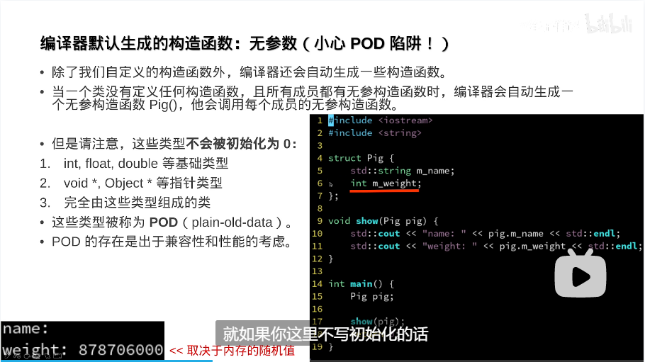
    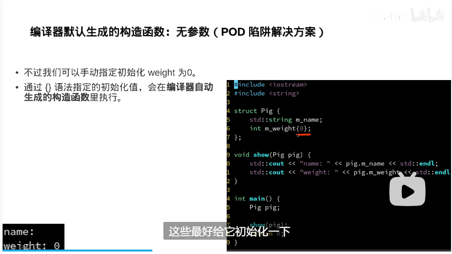

- 编译器默认生成的构造函数：拷贝构造函数
    - 默认生成的是把类所有的变量赋值<br>
    可以通过 = delete;的方式禁止拷贝构造和拷贝赋值函数<br>

    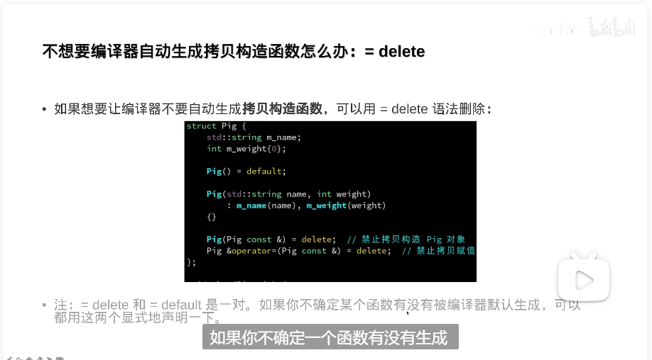
    - 拷贝构造更具有高效性，拷贝赋值追求灵活性

## 编译器生成的全家桶

- 拷贝构造函数
- 拷贝赋值函数
- 移动构造函数
- 移动赋值函数

编译器默认生成情况如下：

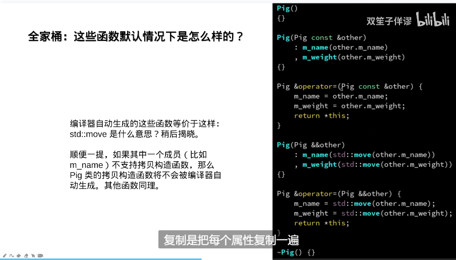

- 除非是智能指针(或指针)，否则都是深拷贝，智能指针是浅拷贝(仅仅拷贝地址)

## 重点：三五法则

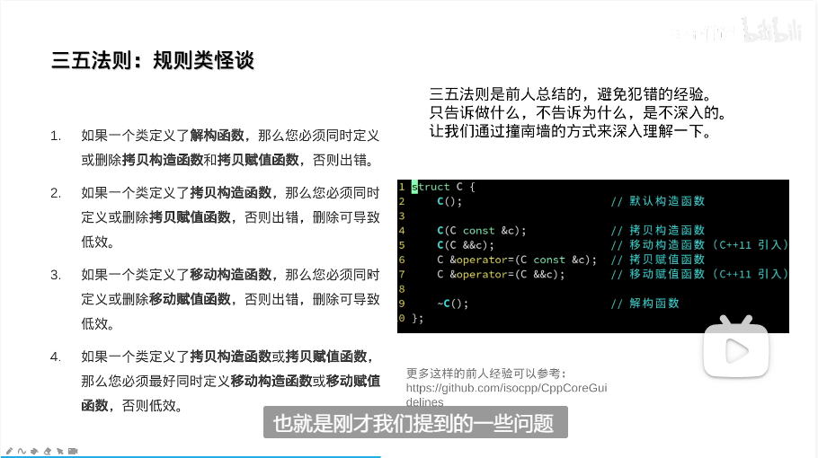

- 如果类里面有指针，而且是一个浅拷贝，那么经过一次构造或一次赋值后，就有两个指针变量操作同一块地址，然后就会发生一块地址被释放两次，会出错。

不考虑性能的赋值

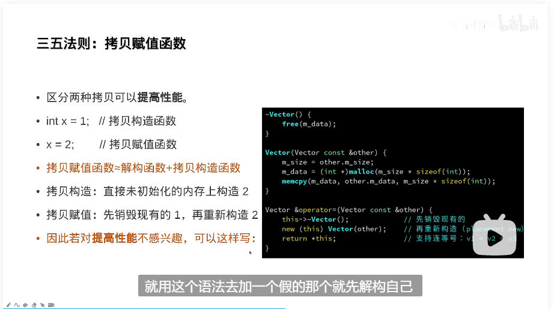

考虑性能的赋值

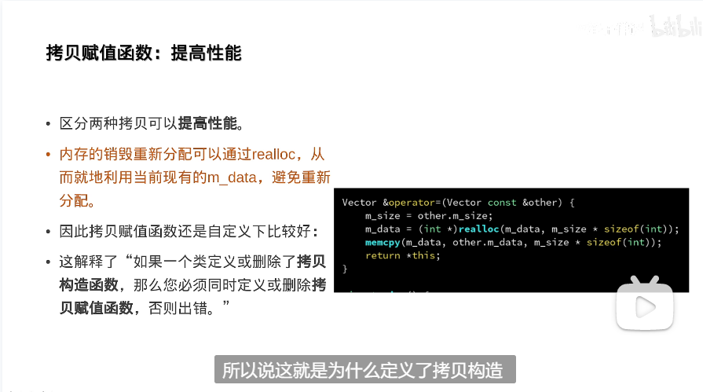

### 移动语义

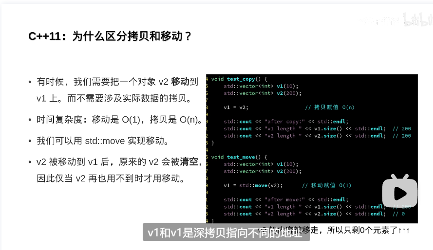

- 移动的高阶用法：交换两者的值

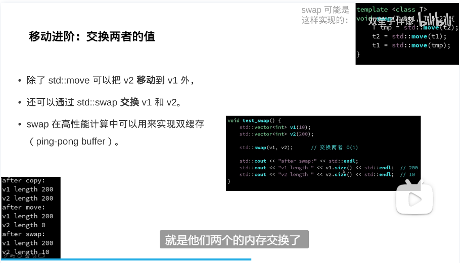

- 如果有移动赋值函数，可以删除拷贝赋值函数

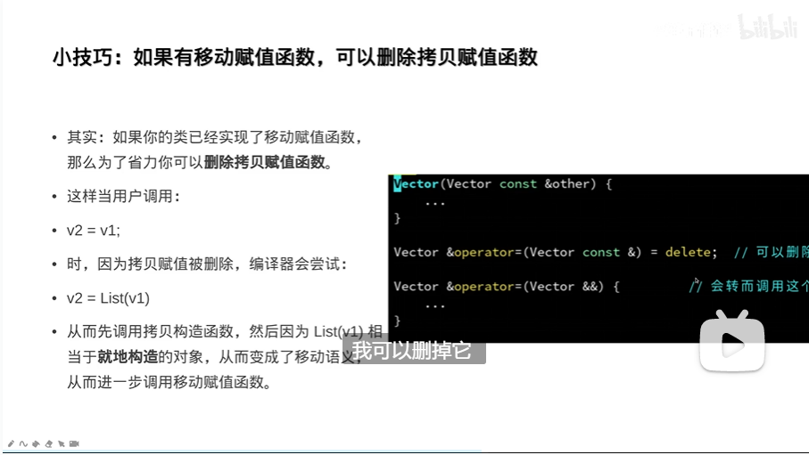

- 总结

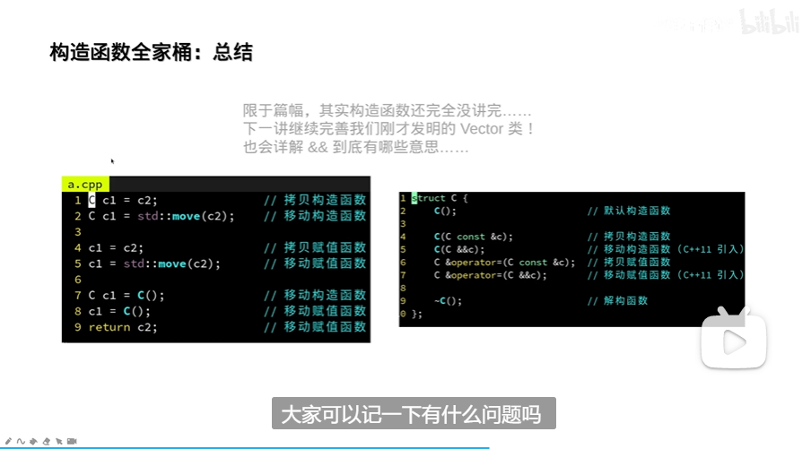

## 难点：智能指针

### RAll解决内存管理问题：unique_ptr

- unique_ptr 示例
    ```cpp
    #include <cstdio>
    #include <memory>

    struct C 
    {
        C()
        {
            printf("分配内存");
        }

        ~C()
        {
            printf("释放内存");
        }
    };

    int main()
    {
        std::unique_ptr<C> p = std::make_unique<C>();

        printf("提前释放....\n");
        p = nullptr;
        printf("释放完成....\n");

        return 0;
    }
    ```
注意：unique_ptr是删除了拷贝构造函数的，所以无法直接赋值，解决方案：<br>

- 1. 获取原始指针，利用 p.get() 获取
    ```cpp
    #include <cstdio>
    #include <memory>

    struct C 
    {
        C()
        {
            printf("分配内存");
        }

        ~C()
        {
            printf("释放内存");
        }
    };

    void func( C *p)
    {
        p->do();
    }

    int main()
    {
        std::unique_ptr<C> p = std::make_unique<C>();
        func(p.get());
        return 0;
    }
    ```
- 2. unique_ptr 禁止拷贝，但是不禁止移动
    ```cpp 
    std::vector<std::unique_ptr<C>> objlist;

    void func(std::unique_ptr<C> p)
    {
        objlist.push_back(std::move(p));
    }

    int main()
    {
        std::unique_ptr<C> p = std::make_unique<C>();
        printf("移交前：%p\n",p.get());
        func(std::move(p));
        printf("移交后：%p\n",p.get());
        return 0;
    }
    ```
### 更智能的指针：shared_ptr 
- 一般而言，unique_ptr是通过禁止拷贝实现的，虽然有效率高的优势，但是导致使用困难，shared_ptr是通过引用计数的方式，允许拷贝。

- shared_ptr 示例：实现安全的浅拷贝
    ```cpp
    std::vector<std::shared_ptr<C>> objlist;

    void func(std::shared_ptr<C> p)
    {
        objlist.push_back(std::move(p)); // 使用移动效率高
    }

    int main()
    {
        std::shared_ptr<C> p = std::make_shared<C>();// 引用计数初始化为1

        func(p); // shared_ptr 允许拷贝，与当前指针共享所有权，引用计数加1
        func(p); // 引用计数继续加1，现在为3

        p->do(); // 引用计数不变，保持3

        objlist.clear(); // 引用计数减二，降为1

        p->do(); // 引用计数保持不变，为1

        return 0; // 最后一个指针p释放，引用计数为0
    }
    ```
可用p.use_count()获取引用计数 

- shared_ptr 劣势：产生循环引用
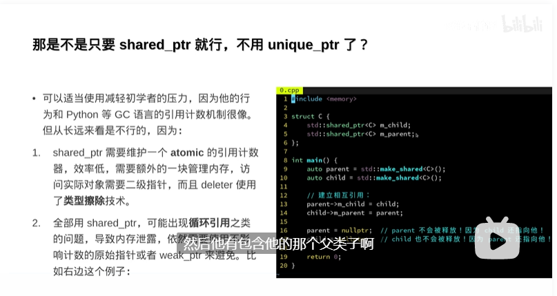

    ```cpp
    #include <memory>

    struct C
    {
        std::shared_ptr<C> m_child;
        std::shared_ptr<C> m_patient;
    };

    int main()
    {
        auto parent = std::make_shared<C>(); // 引用计数为1
        auto child = std::make_shared<C>(); // 引用计数为1

        // 建立循环引用
        parent->m_child = child;  // 引用计数为2
        child->m_parent = parent; // 引用计数为2

        parent = nullptr; // 不会释放，因为引用计数只减1
        child = nullptr;  // 不会释放，因为引用计数只减1

        return 0; // 内存泄漏
    }
    ```
解决办法是：修改std::shared_ptr<C> m_patient;为std::weak_ptr<C> m_patient;

    ```cpp
    #include <memory>

    struct C
    {
        std::shared_ptr<C> m_child;
        std::weak_ptr<C> m_patient;
    };

    int main()
    {
        auto parent = std::make_shared<C>(); // 引用计数为1
        auto child = std::make_shared<C>(); // 引用计数为1

        // 建立循环引用
        parent->m_child = child;  // 引用计数为1
        child->m_parent = parent; // 引用计数为1

        parent = nullptr; // 会释放，因为引用计数只减1,为0
        child = nullptr;  // 不会释放，因为引用计数只减1

        return 0; // 内存泄漏
    }
    ```

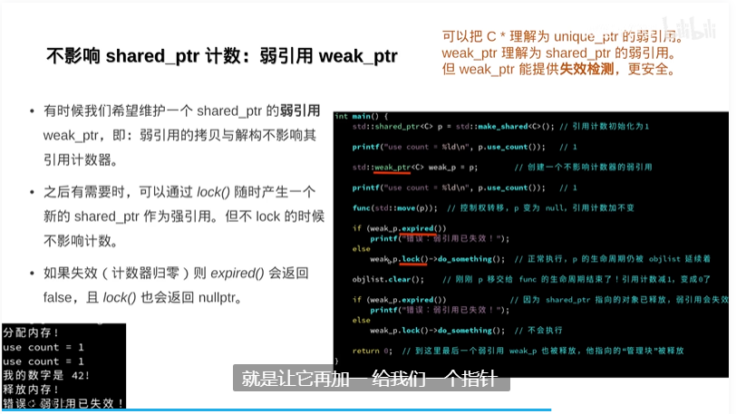

- 作为类的成员变量

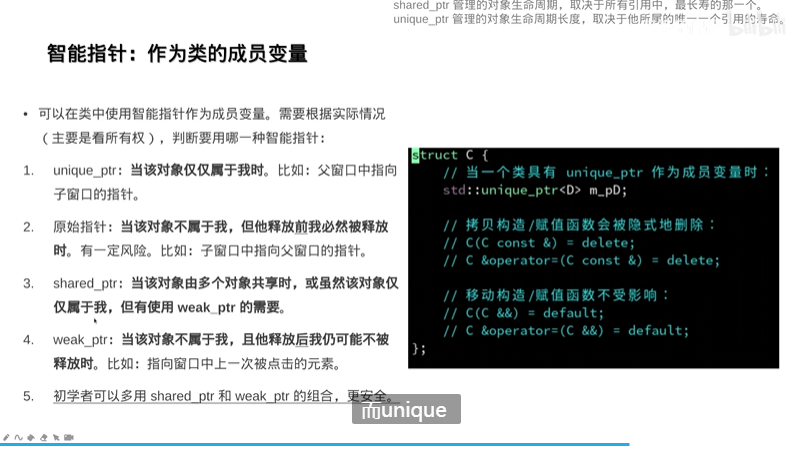

学到这里，我们需要考虑的问题是三五法则在什么时候需要担心？
一般来说，可以认为符合三五法则的类型是安全的。
以下类型是安全的：

- int id; // 基础类型
- std::vector<int> arr; // STL 容器
- std::shared_ptr<Object> child; // 智能指针
- Object *parent; // 原始指针，如果是从智能指针里 .get() 出来的<br>

成员都是安全的类型：五大函数，一个也不用声明<br>

- 如果你的类所有成员，都是安全的类型，那么五大函数都无需声明（或声明为 = default），你的类自动就是安全的。
- 最好的判断方式是：如果你不需要自定义的解构函数，那么这个类就不需要担心。
- 因为如果用到了自定义解构函数，往往意味着你的类成员中，包含有不安全的类型。一般无外乎两种情况：
    - 你的类管理着资源。
    - 你的类是数据结构

一些法则或者说技巧是：<br>

- 这个类管理着某种资源，资源往往不能被“复制”。那么请删除拷贝函数，然后统一用智能指针管理。
- 如果这个类是数据结构，如果可以的话，请定义拷贝和移动，这个类是你精心设计的数据结构，如果这些数据结构是可以支持拷贝的（比如 Vector 就可以），你可能需要自己一个个定义。如果不支持，那就删除（= delete）。
- 还有一个初学者常遇见的问题是，为什么很多函数的参数都是const Pig &pig这种形式，原因是如果函数的参数声明为值类型，很可能会造成一次不必要的拷贝。因此，可以把函数的参数类型声明为：Pig const &pig，这样传递的就是 pig 对象的常引用，从而实际只传递了一个指针，避免了拷贝。

函数参数类型优化规则：按引用还是按值？<be>

- 如果是基础类型（比如 int，float）则按值传递：
    - float squareRoot(float val);
- 如果是原始指针（比如 int *，Object *）则按值传递：
    - void doSomethingWith(Object *ptr);
- 如果是数据容器类型（比如 vector，string）则按常引用传递：
    - int sumArray(std::vector<int> const &arr);
- 如果数据容器不大（比如 tuple<int, int>），则其实可以按值传递：
    - glm::vec3 calculateGravityAt(glm::vec3 pos);
- 如果是智能指针（比如 shared_ptr），且需要生命周期控制权，则按值传递：
    - void addObject(std::shared_ptr<Object> obj);
- 如果是智能指针，但不需要生命周期，则通过 .get() 获取原始指针后，按值传递：
    - void modifyObject(Object *obj);